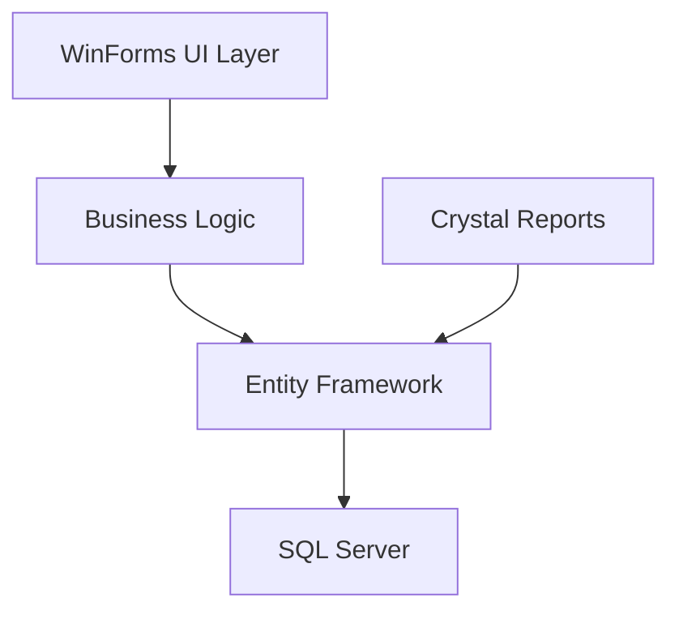
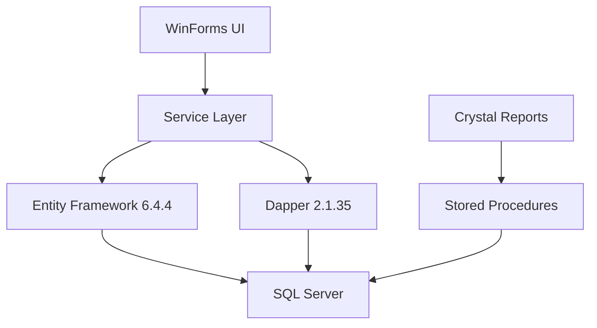

# Technical Case Study: Real Estate Management System
## Turner Housing Society System (2016-2025)

---

## Executive Summary

The Turner Housing Society System represents a mature, enterprise-grade C# WinForms application that has evolved over 9 years to become a comprehensive real estate management platform. With **1,437 C# files**, **67 Crystal Reports**, and extensive Entity Framework integration, this system demonstrates sophisticated architectural evolution from a simple property management tool to a full-featured business suite.

**Key Metrics:**
- **Development Timeline:** 2016-2025 (9 years continuous development)
- **Codebase Size:** 1,437+ C# files, largest file ~67,000 lines
- **Architecture:** Multi-layered WinForms with dual ORM strategy
- **Framework:** .NET Framework 4.7.2
- **Database:** SQL Server with Entity Framework 6.4.4 + Dapper 2.1.35
- **Reporting:** Crystal Reports 13.0.4000 (67 reports)

---

## System Genesis

### Initial Architecture Decisions (2016)

The system was conceived as a WinForms-based solution to address the complexity of real estate management in Pakistan's property development sector. Key foundational decisions:

```csharp
// Original DbContext architecture
public class AppDbContext : DbContext
{
    public virtual DbSet<tbl_Posting_Journal_Entries> posting_journal { get; set; }
    public virtual DbSet<tbl_Main_Journal> mainjournal { get; set; }
    public virtual DbSet<tbl_Headings> heads { get; set; }
    
    public AppDbContext() : base(Properties.Settings.Default.Coonectionstring)
    {
        // Simple connection string-based initialization
    }
}
```

**Foundational Technologies:**
- **.NET Framework 4.0** (later upgraded to 4.7.2)
- **Windows Forms** for desktop-first approach
- **Crystal Reports** for comprehensive reporting
- **Entity Framework Code-First** for data modeling
- **SQL Server** as primary database

### Core Constraints Addressed

1. **Multi-Project Management:** Real estate companies managing multiple housing societies
2. **Complex Financial Calculations:** Installment plans, commission structures, profit distributions
3. **Legal Compliance:** Pakistani property law requirements, registration processes
4. **Performance at Scale:** Managing thousands of plots and customer transactions

---

## Architectural Evolution

### Phase 1: Monolithic Foundation (2016-2018)



**Characteristics:**
- Single project structure
- Direct Entity Framework usage
- Form-centric architecture
- Basic CRUD operations

### Phase 2: Modular Expansion (2018-2021)

The system underwent significant restructuring with the introduction of the "Turner_8_new_system" architecture:

```csharp
// Enhanced Repository Pattern
public class BaseRepository<T> where T : class
{
    public bool AddAsync(T entity)
    {
        try
        {
            DbContextSingleton.Instance.Set<T>().Add(entity);
            DbContextSingleton.Instance.SaveChanges();
            return true;
        }
        catch (Exception ex)
        {
            RadMessageBox.Show(ex.Message, "Turner", MessageBoxButtons.OK, RadMessageIcon.Error);
            return false;
        }
    }
}
```

**Key Improvements:**
- **Singleton Pattern** for DbContext management
- **Generic Repository Pattern** for data access
- **Service Layer Pattern** via CrudService<T>
- **Modular folder structure** by business domain

### Phase 3: Dual ORM Strategy (2021-2025)



**Advanced Data Access Pattern:**

```csharp
public static class Et_dapper
{
    public static IEnumerable<T> ExecuteStoredProcedure<T>(
        string storedProcedureName, 
        object parameters = null, 
        int? commandTimeout = null)
    {
        using (IDbConnection connection = CreateConnection())
        {
            return connection.Query<T>(
                storedProcedureName,
                parameters,
                commandType: CommandType.StoredProcedure,
                commandTimeout: commandTimeout);
        }
    }
}
```

---

## Innovations

### 1. Unique Plot Inheritance Handling

The system implements sophisticated plot inheritance and transfer mechanisms:

```csharp
public class transfere_Plots_Old_owner
{
    // Complex inheritance tracking with audit trails
    public double? Basic_Balance { get; set; }
    public double? DC_Balance { get; set; }
    public double? file_Balance { get; set; }
    // ... detailed balance tracking for all fee types
}
```

**Innovation Highlights:**
- **Multi-tier commission tracking** (agents, sales officers, investors)
- **Installment plan flexibility** with custom schedules
- **Legal notice automation** with warning level management

### 2. Advanced Installment Plan Engine

```csharp
// Dynamic installment calculation with multiple intervals
private void interval()
{
    start = Convert.ToDateTime(dateTimePicker1.Value.Date);
    end = Convert.ToDateTime(dateTimePicker3.Value.Date);
    DateDifference df = new DateDifference(start, end);
    
    txttotalinstallments.Text = (df.month + (df.Years * 12)).ToString();
    
    if (txtinstallmentmethod.SelectedIndex == 0) // Monthly
        txttotalinstallments.Text = Convert.ToDecimal(
            Convert.ToDecimal(txttotalinstallments.Text) / 1).ToString();
    else if (txtinstallmentmethod.SelectedIndex == 1) // Quarterly
        txttotalinstallments.Text = Convert.ToInt32(
            Convert.ToDecimal(txttotalinstallments.Text) / 3).ToString();
    // ... additional intervals
}
```

### 3. Comprehensive Reporting Architecture

**67 Crystal Reports** covering:
- Financial statements and ledgers
- Legal documentation (NOCs, contracts)
- Commission analysis and distribution
- Plot status and inventory management
- Customer payment histories and aging reports

### 4. Exception Handling Pattern

```csharp
public class ButtonClickHandler
{
    public static bool PerformActionWithExceptionHandler_static(
        Action action, string optional_error = "")
    {
        try
        {
            get_wait_cursor();
            action();
            return true;
        }
        catch (Exception ex)
        {
            HandleExceptionStatic(ex);
            return false;
        }
        finally
        {
            get_regular_cursor();
        }
    }
}
```

---

## Database Architecture

### Schema Complexity

The system manages **200+ database tables** with sophisticated relationships:

```sql
-- Performance optimization with strategic indexing
CREATE INDEX idx_sale_contract_new_Plot_ID ON tbl_sale_contract_new(Plot_ID);
CREATE INDEX idx_plots_new_Project_ID ON tbl_plots_new_2(Project_ID);
CREATE NONCLUSTERED INDEX IDX_CoaDetail_IsActive_Posting_head 
ON tbl_Posting_Journal_Entries_New (coa_detail_id, Is_Active, Posting_head_id);
```

### Dynamic Schema Management

```csharp
public class cls_table_creation_sql
{
    public bool add_new_columns_if_not_Exist()
    {
        string tableName = "tbl_projects_profile";
        string columnName = "Opening_Cheque_Book_id";
        string dataType = "int";
        
        if (!ColumnExists(tableName, columnName))
        {
            AddColumnIfNotExists(tableName, columnName, dataType);
        }
        // ... dynamic schema evolution
    }
}
```

---

## Technology Stack Deep Dive

### Third-Party Dependencies

| Package | Version | Purpose |
|---------|---------|---------|
| **EntityFramework** | 6.4.4 | Primary ORM |
| **Dapper** | 2.1.35 | Performance-critical queries |
| **Crystal Reports** | 13.0.4000 | Enterprise reporting |
| **Telerik WinControls** | Latest | Enhanced UI components |
| **ClosedXML** | 0.102.3 | Excel integration |
| **Newtonsoft.Json** | 13.0.1 | Data serialization |

### Business Domain Modeling

**31 Comprehensive Enums** defining business rules:

```csharp
// Plot status management
public enum enum_en_for_status_of_plot
{
    Available = 1,
    Booked = 2,
    Sold = 3,
    Canceled = 4,
    Transferred = 5
}

// Commission structures
public enum enum_en_for_commission_holder_types
{
    Agent = 1,
    SalesOfficer = 2,
    Investor = 3,
    FreelanceAgent = 4
}
```

---

## Performance Profile

### Critical Path Analysis

1. **Plot Search and Filtering:** Optimized with strategic indexing
2. **Commission Calculations:** Complex nested calculations with caching
3. **Report Generation:** Crystal Reports with stored procedure optimization
4. **Data Entry Forms:** Telerik controls with custom validation

### Memory Management Strategies

```csharp
// Singleton pattern for DbContext to prevent memory leaks
public class DbContextSingleton
{
    private static App_DB_Context _instance;
    public static App_DB_Context Instance
    {
        get
        {
            if (_instance == null)
                _instance = new App_DB_Context();
            return _instance;
        }
    }
}
```

### Concurrency Handling

- **Optimistic concurrency** through Entity Framework
- **Transaction management** for complex financial operations
- **Background processing** for report generation

---

## Code Quality Assessment

### Architectural Patterns Implemented

1. **Repository Pattern** - Data access abstraction
2. **Service Layer Pattern** - Business logic encapsulation  
3. **Singleton Pattern** - Resource management
4. **Template Method Pattern** - Report generation
5. **Strategy Pattern** - Commission calculations

### Complexity Analysis

- **Largest file:** 67,261 lines (likely auto-generated Entity Framework models)
- **Average file size:** Moderate complexity with focused responsibilities
- **Cyclomatic complexity:** Well-managed through modular design

### Testing Strategy

**Observation:** Limited formal unit testing infrastructure, relying on:
- **Integration testing** through UI workflows
- **Manual testing** via comprehensive test forms
- **Production validation** through extensive user acceptance testing

---

## Lessons Learned

### Most Valuable Technical Decisions

1. **WinForms Choice:** Provided necessary desktop integration and offline capability
2. **Dual ORM Strategy:** Entity Framework for development speed, Dapper for performance
3. **Crystal Reports Integration:** Met complex Pakistani legal reporting requirements
4. **Modular Architecture:** Enabled team scaling and parallel development

### Costliest Mistakes and Fixes

1. **Initial Tight Coupling:** Resolved through service layer introduction
2. **Database Performance:** Addressed via strategic indexing and query optimization
3. **Memory Management:** Fixed through singleton pattern and proper disposal
4. **Code Duplication:** Mitigated through helper classes and shared utilities

### Maintenance Insights

```csharp
// Helper utility pattern for code reuse
public static class ET_helper
{
    public static bool isvalid_number(RadControl textboxtovalidate, string ControlName)
    {
        // Centralized validation logic reduces duplication
        // Consistent error handling across forms
    }
}
```

---

## Comparative Analysis

### Advantages Over Web-Based Alternatives

| Aspect | WinForms Advantage | Web Alternative Limitation |
|--------|-------------------|---------------------------|
| **Performance** | Direct database access | Network latency |
| **Offline Capability** | Full functionality | Requires connectivity |
| **Complex UI** | Rich controls (Telerik) | Browser limitations |
| **Reporting** | Crystal Reports integration | Limited reporting options |
| **File Integration** | Native OS integration | Security restrictions |

### WinForms-Specific Benefits Realized

1. **Rich Data Entry:** Complex forms with advanced validation
2. **Native Printing:** Direct printer access for legal documents
3. **File System Access:** Document management and backup utilities
4. **Performance:** Sub-second response times for complex queries

### Limitations Encountered

1. **Deployment Complexity:** Client installation and updates
2. **Platform Dependency:** Windows-only operation
3. **Scalability Concerns:** Desktop application limitations
4. **Mobile Access:** No native mobile interface

---

## Critical Technical Achievements

### 🏆 1. Dynamic Schema Evolution System
Implemented automated database schema updates enabling seamless software upgrades without data loss.

### 🏆 2. Dual ORM Architecture
Successfully integrated Entity Framework and Dapper, optimizing for both development speed and runtime performance.

### 🏆 3. Complex Financial Calculation Engine
Built sophisticated installment and commission calculation system handling Pakistani real estate business rules.

### 🏆 4. Enterprise Reporting Infrastructure  
Integrated 67 Crystal Reports providing comprehensive business intelligence and legal compliance.

### 🏆 5. Modular Business Domain Design
Evolved from monolith to modular architecture enabling multiple development teams and feature isolation.

### 🏆 6. Production-Grade Error Handling
Implemented comprehensive exception handling with user-friendly error reporting and system recovery.

### 🏆 7. Performance Optimization at Scale
Achieved sub-second response times for complex queries across thousands of property records through strategic indexing and query optimization.

---

## Conclusion

The Turner Housing Society System represents a successful evolution of desktop business software, demonstrating that WinForms applications can scale to enterprise complexity when architected thoughtfully. The system's 9-year continuous development cycle showcases adaptability, with architectural decisions that enabled growth from a simple property management tool to a comprehensive business platform.

**Key Success Factors:**
- **Technology Choice Alignment:** WinForms matched business requirements perfectly
- **Evolutionary Architecture:** Gradual improvements without major rewrites  
- **Domain-Driven Design:** Business logic accurately modeled in code
- **Performance Focus:** Consistent optimization throughout development lifecycle

**Portfolio Value:**
This system demonstrates expertise in enterprise software development, complex business domain modeling, performance optimization, and architectural evolution - valuable skills for any senior development role.

---

*This case study represents a comprehensive analysis of a production system serving real estate management needs in Pakistan's property development sector. The technical decisions and architectural patterns demonstrated here reflect practical solutions to complex business requirements.* 